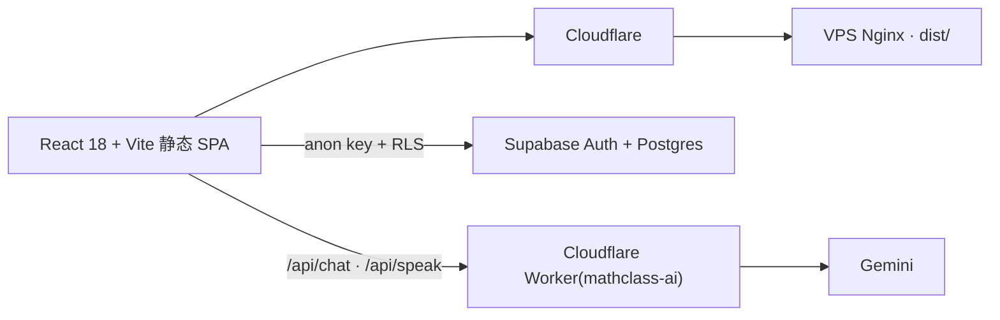

# Carnet de classe

> 每天一条定理,每天一句话。中文和法语是这个网站的灵魂。

[](https://rucmathclass.com/)
[](https://github.com/jsfjsf20070513-a11y/rucmathclass/actions)
[](LICENSE)

中国人民大学中法学院数学班的班级手册站。产品身份做过一次彻底的减法,只留两件事:**读**与**练**。
2026-08-20 起,整站是一本**横翻的杂志刊**——每页占满一屏、一页一主角,自带细导航,不设传统页眉页脚。

## 页面

| 页 | 路由 | 内容 |
|---|---|---|
| 扉页 | `/` | 每日定理(48 条,对齐大二上四门课,中法双语证明,构建期 KaTeX 预渲染)+ Parole du jour(38 条真实引语) |
| 资源书架 | `/resources` | 静态目录 + Supabase `resources` 增补;外链一律先消毒再渲染 |
| 背词 | `/vocabulary` | 3652 条法语词汇,A1–C2 分级,艾宾浩斯 SRS 复习阶梯(纯核心 [`src/lib/srsScheduler.js`](src/lib/srsScheduler.js),已单测);进度存 `review_states`,per-user RLS |
| AI 助手 | `/assistant` | 登录后使用;经 Cloudflare Worker `/api/chat` 调 Gemini(模型降级链每小时动态发现),云端历史存 `ai_messages` |
| 寄语墙 | `/witness` | 仅存的 Web3 界面:Anchor 程序在 Solana **devnet**(见下方「诚实说明」) |

## 技术形态

React 18 + React Router 7 + Vite 5 **静态 SPA**;Supabase(仅 anon key,RLS 强制)承担认证与数据;KaTeX 数学渲染在构建期完成。AI 与语音的密钥只存在于 Cloudflare Worker(`worker/`)的 secrets 里,永不进入浏览器产物。



## 本地开发

要求 Node.js 版本见 [`.nvmrc`](.nvmrc)。

```bash
npm install
npm run dev        # predev 自动跑 render-theorems + generate-health
```

质量闸(与 CI 一致):

```bash
npm run lint && npm test && npm run build
```

`public/health.json` 是构建落痕(带时间戳),按惯例提交前 `git restore public/health.json`。

## 数据

- **每日定理**:源在 `src/data/siteContent.js` 与 `src/data/theoremExplanations.js`,构建期预渲为 `*.generated.js`。
- **词库**:真相源是 [`scripts/vocab-source.json`](scripts/vocab-source.json),经 `npm run vocab:import` 生成 `src/data/frenchVocabulary.js`;已有词条 `id` 对应用户的 `review_states.word_id`,不可随意更改。
- **Supabase**:按需执行 `setup_vocabulary.sql` / `setup_ai_history.sql` 等建表脚本;全项目权威 RLS 状态是 [`harden_rls.sql`](harden_rls.sql)。

## 安全边界

- 前端只持有 Supabase anon key;RLS 是唯一安全边界。
- `comments.user_email` 对 anon 做了列级 REVOKE;查询必须显式列名。
- 角色提升只经过 `public.is_super_admin()` 的 security-definer 边界。
- 仓库内没有任何真实班级照片(相册数据走 Supabase `albums` / `album_photos`)。

## 仓库拓扑(2026-08-25 起)

- 本仓 = **班级网站线**,默认分支 `mathclass/main`,线上 `rucmathclass.com` 的构建来源。
- 姊妹站 **Raccord**(作者数字作品,未首发)已拆至独立仓 [`raccord`](https://github.com/jsfjsf20070513-a11y/raccord);本仓的旧 `main` 分支只是拆仓前的只读引用(tag `backup/pre-split-2026-08-25`),不在其上开发。
- 更早的原始班级站存档在 [`mathclass-archive`](https://github.com/jsfjsf20070513-a11y/mathclass-archive)(GitHub 只读归档)。

## 部署

`deploy.sh` 只读环境变量,不含任何主机名或密钥;构建后 rsync `dist/` 到服务器。私有照片注入链路已退役,部署时显式 `MATHCLASS_PRIVATE_REPO=skip`。部署后以 `https://rucmathclass.com/health.json` 的 `buildTime` 为准做前后对照。

## 诚实说明

- 寄语墙的链上部分在 Solana **devnet**——devnet 会周期性 reset,"永久保存"并不成立,如实化(或镜像进 Supabase)在待办里。
- 语音朗读当前使用 preview 模型,无稳定性承诺。
- `/resources/curate` 的推荐提交会进入待审队列,站内审核界面暂时下线,处理会有延迟。

## License

[MIT](LICENSE) — 覆盖源代码;班级具体内容(照片等)不在本仓,亦不在授权范围内。
